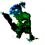
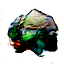
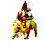

# **GAN Pokemon**

I will use this project to learn how to train GAN's, how they work and apply it on Pokemon data to try and create new fun forms of pokemon.  
There are a few similar projects on Github that inspired me :  
- https://github.com/kvpratama/gan/tree/master/pokemon
- https://github.com/moxiegushi/pokeGAN  

## **Pokemon GAN**
<hr />

<a href="url"></a>
<a href="url"></a>
<a href="url"></a>  


I used a pytorch implementation for the dataloading, model and training. For that i used an already existing one that i found [here], and reworked it to fit my needs. 
I also used the tips and tricks from this [github]. The goal is to smooth the training of the model and improve it's stability. 


The model is able to create blobs of color with forms that could ressemble animal/pokemon forms, but no details (no eyes, nose etc...).  
Such as those : 

<a href="url"></a>
<a href="url"></a>
<a href="url"></a>  

as you can see, these are not super cool new pokemons yet, but this project is still in it's infancy.  

[here]: https://pytorch.org/tutorials/beginner/dcgan_faces_tutorial.html
[github]: https://github.com/soumith/ganhacks

## **Model & Backbone**
<hr />

### **DCGAN**
 

Basically, the **generator** is a CNN that is trained to turn a tensor of random (gaussian) noise into an image, and the **discriminator** is also a CNN that is trained to differentiate between real images and fake created by the **generator**. (I put a link to the paper in the references down below)  
The particularity of GAN's such as this one is that in the case of creating new pokemons is that there isn't a real benchmark to tell you when the model is good or not, it's good when it's able to create images that you find good enough. 

### **SNGAN**

Spectral Normalization is a method used to help stabilize the training process of the discriminator. \
I linked the paper below you'll find more information.

## **Code**
<hr />

### **Prerequisites**
```
python -m pip install -r requirements.txt
```

### **Train**

```
python -m run 
--model=DCGAN 
--backbone=CONVNET 
--loss=BCE 
--run_note=NAME_OF_RUN
```

* model : **DCGAN** or **SNGAN**
* backbone : **CONVNET** or **RESNET**
* loss : **BCE**, **LB_CE** (Label Smoothing Cross entropy) or **WGAN**
* run_note : a name for the training run. 

### **Evaluate**
Evaluation function can be used on a specified checkpoint to generate a batch of fake images from you checkpoint model in a result/ folder  
You must specify the model used in your checkpoint and a path to the checkpoint file :

```
python -m inference 
--model=DCGAN 
--backbone=CONVNET 
--path=checkpoint/checkpoint_name.pt
--note=NAME_OF_EVAL
```

### Tensorboard
I use tensorboard to save some informations about models trained : 
* Save G and D loss after each epoch
* Save a grid of fake images every few epochs

The results are in a runs/run_note folder :

```
tensorboard --logdir=runs/NAME_OF_RUN
```

## **Next steps**
<hr />
The next steps for this project include :  

* Changing the model (image size, more performant model)
* Improving the dataset (Cleaning images that are too similar, adding new images)
* Look into SN-GAN and SAGAN for next implementation

## **Reference**
[1] [Unsupervised Representation Learning with Deep Convolutional Generative Adversarial Networks](https://arxiv.org/abs/1511.06434)  \
[2] [Generative Adversarial Networks](https://arxiv.org/abs/1406.2661v1)  \
[3] [Wasserstein GAN](https://arxiv.org/abs/1701.07875) \
[4] [Improved Training of Wasserstein GANs](https://arxiv.org/pdf/1704.00028.pdf) \
[5] [Spectral Normalization for Generative Adversarial Networks](https://arxiv.org/abs/1802.05957)
